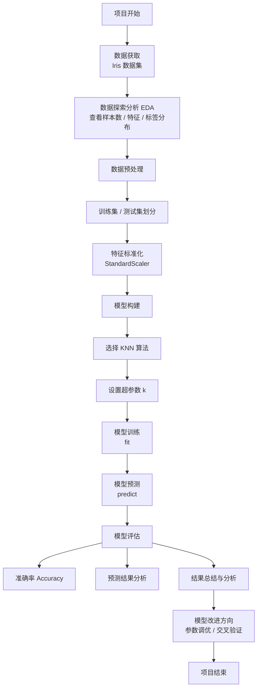

> - [下载本文对应的 Jupyter Notebook 文件](https://github.com/cherry384719/Code_storage/blob/main/iris_knn_classification.ipynb)
- [在线预览](https://nbviewer.org/github/cherry384719/Code_storage/blob/main/iris_knn_classification.ipynb)
{: .prompt-info}

## 实现流程：
- 1.加载数据集
- 2.数据预处理
- 3.特征工程（特征提取、标准化...）
- 4.模型训练
- 5.模型预测与评估

<details class="details-inline" markdown="1">
<summary>flowchart</summary>



</details>

### **第一步：** 从`sklearn.datasets`中获取iris数据集

```python
from sklearn.datasets import load_iris

# 加载鸢尾花数据集，返回特征和标签
iris = load_iris()  
X = iris.data		# 特征：4个特征 - 花萼长度、花萼宽度、花瓣长度、花瓣宽度
y = iris.target	    # 标签：3种鸢尾花 - setosa、versicolor、virginica
```

`data`、`target`表示的值见下图：


#### 可视化数据集

```python
import seaborn as sns
import matplotlib.pyplot as plt
import pandas as pd
from sklearn.datasets import load_iris

# 显示鸢尾花数据
def showIris():

    # 1 加载鸢尾花数据集
    mydataset = load_iris()

    # 2 将数据转换成DataFrame格式，设置data和columns属性，设置目标值名称
    iris_d = pd.DataFrame(mydataset['data'], columns=mydataset.feature_names)
    iris_d['label'] = mydataset.target
    print('\niris_d（前5行）-->\n', iris_d[:5])  # 显示前5行数据
    col1 = 'sepal length (cm)'
    col2 = 'petal width (cm)'

    # 3 使用sns.lmplot()进行显示
    sns.lmplot(x=col1, y=col2, data=iris_d, hue='label', fit_reg=False)
    plt.xlabel(col1)
    plt.ylabel(col2)
    plt.title('Iris Data Visualization')
    plt.show()

showIris()
```


### **第二步：** 数据预处理

```python
# 数据集划分
from sklearn.model_selection import train_test_split

# 从150个样本中划分出20%作为测试集，80%作为训练集
# 参数说明：
# X: 特征数据
# y: 标签数据
# test_size: 测试集所占比例，这里是20%
# random_state: 随机种子，保证每次划分结果相同
X_train, X_test, y_train, y_test = train_test_split(X, y, test_size=0.2, random_state=42)

```

### 第三步：特征工程

```python
# 特征提取：由于iris数据集的特征已经是数值型的，所以这里不需要额外的特征提取步骤

# 标准化
from sklearn.preprocessing import StandardScaler

scaler = StandardScaler()                 # 创建StandardScaler对象
X_train = scaler.fit_transform(X_train)   # 训练集标准化，使用fit_transform，先训练再转换
X_test = scaler.transform(X_test)         # 测试集标准化，这里使用transform方法，不用fit_transform

```

### 第四步：模型训练

```python
from sklearn.neighbors import KNeighborsClassifier

# 创建KNN分类器对象，设置邻居数为3
knn = KNeighborsClassifier(n_neighbors=3)
# 训练KNN分类器
knn.fit(X_train, y_train)

```

### 第五步：模型预测与评估

```python
# 场景一：对之前切分的测试集进行预测
y_pred = knn.predict(X_test)
# 计算准确率
accuracy = knn.score(X_test, y_test)
print(f'\nKNN分类器在测试集上的准确率: {accuracy * 100:.2f}%')

# 场景二：对新样本进行预测
new_samples = [[5.1, 3.5, 1.4, 0.2],   # 预期类别：0 (setosa)
               [6.7, 3.1, 4.7, 1.5],   # 预期类别：1 (versicolor)
               [7.2, 3.6, 6.1, 2.5]]   # 预期类别：2 (virginica)
new_samples_scaled = scaler.transform(new_samples)  # 对新样本进行标准化
predictions = knn.predict(new_samples_scaled)
print('\n新样本预测结果:')
for sample, pred in zip(new_samples, predictions):
    print(f'样本 {sample} 预测类别: {pred} ({iris.target_names[pred]})')

```

## 总结
本Notebook完成了鸢尾花数据集的KNN分类流程，包括数据加载、可视化、训练集/测试集划分、特征标准化、模型训练与预测评估。结果展示了模型在测试集上的准确率，并对新样本进行了类别预测。后续可通过调整`n_neighbors`、尝试不同距离度量或使用交叉验证来进一步优化模型效果。


