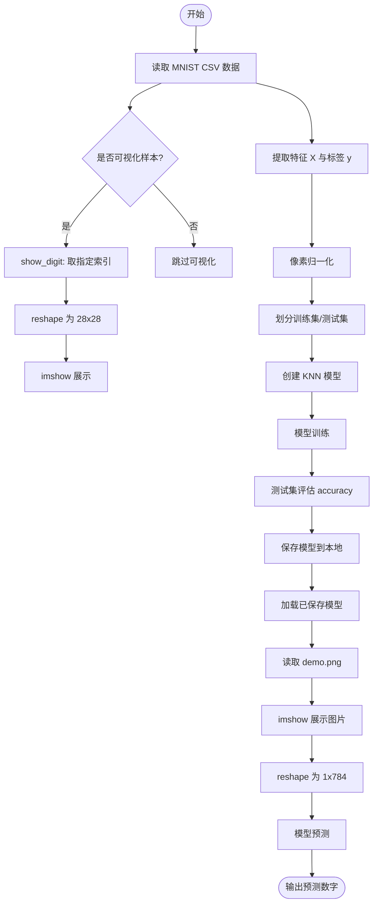

> 在此下载本文对应的 Jupyter Notebook 文件及数据： 
- [**number_knn_classification.ipynb**](https://github.com/cherry384719/Code_storage/blob/main/Handwritten%20digit%20recognition/Handwritten_digit_recognition.ipynb)（点击[这里](https://nbviewer.org/github/cherry384719/Code_storage/blob/main/Handwritten%20digit%20recognition/Handwritten_digit_recognition.ipynb)可进行预览）
- [**data/mnist_test.csv**](https://github.com/cherry384719/Code_storage/blob/main/Handwritten%20digit%20recognition/data/mnist_test.csv)
- [**data/demo.png**](https://github.com/cherry384719/Code_storage/blob/main/Handwritten%20digit%20recognition/data/demo.png)
{: .prompt-info}

## 利用 KNN 算法实现手写数字识别


### 实现流程：
- 1.读取数据集并可视化样本
- 2.数据预处理（归一化 + 划分训练/测试集）
- 3.训练 KNN 模型
- 4.保存模型并进行预测

<details class="details-inline" markdown="1">
<summary>flowchart</summary>



</details>


#### **第一步：** 读取 MNIST 数据并可视化样本

MNIST 每张图是 $28\times28$ 的灰度图，展开后就是 784 维特征。CSV 结构通常是：

- 第 1 列：标签（0~9）
- 第 2~785 列：像素值（0~255）

可视化函数会读取 CSV，取出指定索引的一行像素并画出来，方便确认数据是否读取正确。

```python
import matplotlib.pyplot as plt
import pandas as pd
from sklearn.model_selection import train_test_split
from sklearn.neighbors import KNeighborsClassifier
import joblib	# 保存模型

# 每张图片都是由 28 * 28 = 784 个像素点组成的 
# 我们可以把每张图片看作是一个包含 784 个特征的样本。

# 定义函数，接受用户传入索引，显示对应的手写数字图片
def show_digit(index):
    data = pd.read_csv('./data/mnist_test.csv')  # 读取数据集
    if(index < 0 or index >= len(data)):
        print("索引超出范围，请输入有效的索引值（0-{}）".format(len(data)-1))
        return

    X = data.iloc[:, 1:]  # 提取像素数据
    image = X.iloc[index].values.reshape(28, 28)  # 将一维数组重塑为28x28的二维数组
    plt.imshow(image, cmap='gray')                   # 使用灰度图显示图片
    plt.axis('off')                                  # 关闭坐标轴
    plt.show()                                       # 显示图片

show_digit(9) # 显示索引为9的图片
```
运行结果：

{: .normal}


#### **第二步：** 数据预处理

训练前做两件事：

1. 像素归一化到 $[0,1]$
2. 划分训练集/测试集（用于评估）

> 这里演示文件使用 `mnist_test.csv`，正式训练建议替换成训练集文件。
{: .prompt-tip}

#### **第三步：** 训练 KNN 模型

创建 `KNeighborsClassifier`，设置邻居数 `n_neighbors=5`，用训练集拟合模型。训练完成后用测试集计算准确率。

#### **第四步：** 保存模型并进行预测

模型训练完成后保存到 `./my_model/knn_mnist_model.pkl`，预测时直接加载。

- 读取 `demo.png` 作为输入（建议 $28\times28$ 灰度图）
- `plt.imread()` 读入的像素已经在 $[0,1]$，无需再次归一化
- reshape 为 $1\times784$ 后进行预测


**预处理、训练、保存模型：**
```python
def train_model():
    data = pd.read_csv('./data/mnist_test.csv')  # 读取数据集
    X = data.iloc[:, 1:] / 255.0  # 提取像素数据并归一化
    y = data.iloc[:, 0]   # 提取标签数据

    # 将数据集拆分为训练集和测试集
    X_train, X_test, y_train, y_test = train_test_split(X, y, test_size=0.2, stratify=y, random_state=40)

    # 创建KNN分类器实例
    knn = KNeighborsClassifier(n_neighbors=5)

    # 训练模型
    knn.fit(X_train, y_train)

    # 在测试集上评估模型
    accuracy = knn.score(X_test, y_test)
    print("模型在测试集上的准确率: {:.2f}%".format(accuracy * 100))

    # 保存模型到文件
    joblib.dump(knn, './my_model/knn_mnist_model.pkl')
    print("模型训练完成并已保存到 './my_model/knn_mnist_model.pkl' 文件中。")

train_model()
```

**加载模型并进行预测：**
```python
def load_model_and_predict():
    # 加载保存的模型
    knn = joblib.load('./my_model/knn_mnist_model.pkl')

    # 加载图片数据
    X = plt.imread('./data/demo.png') 

    # 绘制图片
    plt.imshow(X, cmap='gray')
    plt.axis('off')
    plt.show()
    
    # 注意，此时图片不需要进行归一化了，因为通过plt.imread读取的像素值已经在0-1之间
    X = X.reshape(1, -1)# 重塑为一维数组

    # 使用加载的模型进行预测
    prediction = knn.predict(X)
    print("预测的数字是:", prediction[0])

load_model_and_predict()
```


### 总结
本 Notebook 完成了手写数字识别的 KNN 流程：数据读取、可视化、训练/测试集划分、模型训练与评估、模型保存与预测。后续可通过调整 `n_neighbors` 或尝试不同距离度量进一步优化效果。

