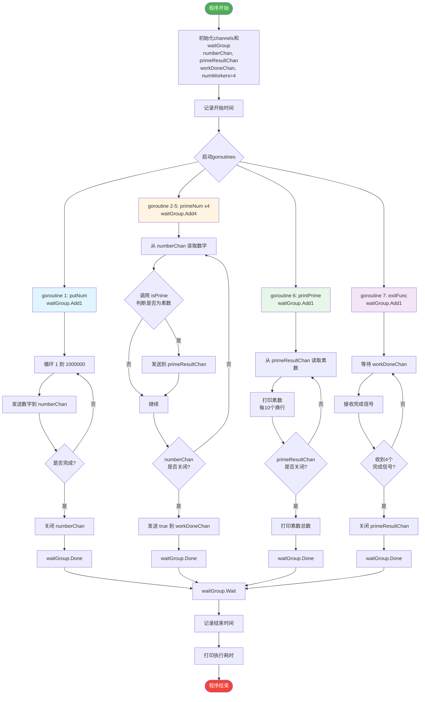

## GO并发

### 目标：找出2~1e6中的所有素数

#### 0. 整体流程




#### 1. 在协程中将2~1e6遍历输入至管道

```go
// putNum 存放数字到 channel (存放1-1e6的数字)
func putNum(numberChan chan<- int) {
    defer waitGroup.Done()
    for num := 1; num <= 1e6; num++ {
        numberChan <- num
    }
    close(numberChan)
}
```

注意函数结束后要将计数器减一，即`defer waitGroup.Done()`，记得遍历完后关闭管道`close(numberChan)`，否则后续无法得到管道中的值。

<div class="box-info" markdown="1">
<div class="title"> Q：为什么要在协程中将数输入管道，不能在进程中进行吗？ </div>

比如：

```go
func main() {
    numberChan := make(chan int, 1000)
    // go putNum(numberChan)
    for num := 1; num <= 1e6; num++ {
        numberChan <- num
    }
    close(numberChan)
    // 接下来开4个子协程判断管道中的素数
    ...
```

**A：**如果按照上面的代码执行，那么`numberChan`会阻塞：
只有将所有的数放进管道中才能进行下一步的并行判断，此时`numberChan` 的容量不够，而且不符合同时放入、同时判断的并发效果。

而使用协程`go putNum(numberChan)` 则能做到一边放、一边读取进行判断的效果。

</div>

   

#### 2. 4个判断素数的协程

从`numberChan` 中取出数，判断后放入`primeResultChan` 

```go
func primeNum(numberChan <-chan int, primeResultChan chan<- int) {
    defer waitGroup.Done()
    for num := range numberChan {
        if(isPrime(num)) {
            primeResultChan <- num
        }
    }
}

primeResultChan := make(chan int, 2000)
for i := 0; i < 4; i++ {
    waitGroup.Add(1)
    go primeNum(numberChan, primeResultChan)
}
```

但是，`primeResultChan` 没有关闭，无法在后面读取其中的数。所以要实现一个监视4个判断素数的协程的另一个协程：

```go
// 首先开一个管道记录4个协程是否完成
// 每一个协程结束后向管道中加入标识符true
workDoneChan := make(chan bool, 4)
// 修改primeNum函数
func primeNum(numberChan <-chan int, primeResultChan chan<- int, workDoneChan chan<- bool) {
    defer waitGroup.Done()
    for num := range numberChan {
        if(isPrime(num)) {
            primeResultChan <- num
        }
    }
    wokDoneChan <- true // 加入这行
}

// exitFunc 判断关闭 primeResultChan 的协程
func exitFunc(workDoneChan <-chan bool, primeResultChan chan int, numWorkers int) {
    defer waitGroup.Done()
    // 等待所有 primeNum goroutine 完成
    for i := 0; i < numWorkers; i++ {
        <-workDoneChan
    }
    // 关闭 primeResultChan
    close(primeResultChan)
}
```

#### 3. 打印素数

```go
// printPrime 打印素数
func printPrime(primeResultChan <-chan int) {
    defer waitGroup.Done()
    primeCount := 0
    for prime := range primeResultChan {
        fmt.Printf("%d ", prime)
        primeCount++
        if primeCount%10 == 0 {
            fmt.Println()
        }
    }
    fmt.Printf("\n总共有 %d 个素数\n", primeCount)
}
```

#### 4. 总体流程

```go
func main() {
    numberChan := make(chan int, 1000)
    primeResultChan := make(chan int, 2000)
    workDoneChan := make(chan bool, 4)

    // 启动多个统计素数的协程
    numWorkers := 4

    startTime := time.Now() // 记录开始时间
    // putNum goroutine
    waitGroup.Add(1)
    go putNum(numberChan)

    // primeNum goroutines (开启多个统计素数的 channel)
    waitGroup.Add(numWorkers)
    for i := 0; i < numWorkers; i++ {
        go primeNum(numberChan, primeResultChan, workDoneChan)
    }

    // printPrime goroutine
    waitGroup.Add(1)
    go printPrime(primeResultChan)

    // exitFunc goroutine
    waitGroup.Add(1)
    go exitFunc(workDoneChan, primeResultChan, numWorkers)

    waitGroup.Wait()
    endTime := time.Now() // 记录结束时间
    fmt.Printf("程序执行完毕，耗时：%d 毫秒\n", endTime.Sub(startTime).Milliseconds())
}

```

<div class="box-info" markdown="1">
<div class="title"> Q：printPrime 和 exitFunc 这两个函数的顺序有问题吧，不应该先设定exitFunc来关闭管道，然后再printPrime遍历闭合的管道吗？ </div>

**A：没有问题**。当前的顺序是正确的，你的理解有个误区：

1.  **goroutine 的启动顺序 ≠ 执行顺序**
- 这两个 goroutine 是**并发运行**的，启动后都在同时执行
- `printPrime` 会一直阻塞在 `for prime := range primeResultChan` 等待数据
- `exitFunc` 会阻塞在 `<-workDoneChan` 等待完成信号

2.  **执行流程：**

```markdown
启动 printPrime → 开始等待 primeResultChan 的数据
启动 exitFunc   → 开始等待 workDoneChan 的信号

↓ (并发进行)

primeNum 写入素数 → printPrime 读取并打印
primeNum 完成    → 发送信号到 workDoneChan

↓ (所有 primeNum 完成后)

exitFunc 收到所有完成信号 → 关闭 primeResultChan
printPrime 的 range 循环结束 → 打印总数并退出
```

3.  **为什么顺序无所谓：**

- `printPrime` 中的 `range` 会一直等待，直到 channel 被关闭且清空
- `exitFunc` 关闭 channel 的时机是正确的（所有生产者完成后）
- 两者是协作关系，不存在竞态

**结论**：当前代码逻辑完全正确，调换这两行的启动顺序也不会影响程序行为，因为它们都是并发运行的协程。

</div>


运行耗时大概在80-100ms，对比于cpp编写的一个进程运行耗时7s来说非常快了。
